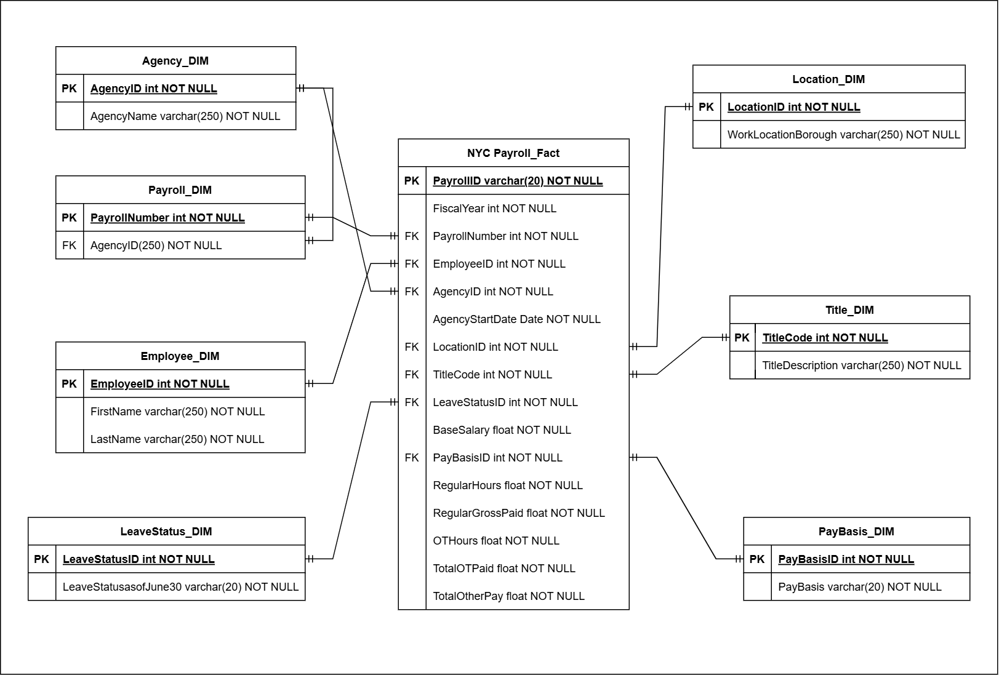
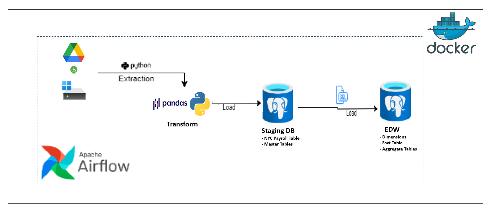

# NYC Payroll Data ETL Pipeline

This project provides a comprehensive Modular Data ETL Pipeline solution to extract NYC Payroll Data data from flat CSV files downloaded from Google Cloud storage to a local PC, transform the extracted data 
and load it to a Staging Database on an on-premises PostgreSQL. The Transformed data from the Staging Area is then loaded into structured dimensions and fact tables in an Enterprise Data Warehouse EDW for 
reporting and analysis. Also, to ease the analysis of key business questions, Aggregate tables that answer the following business questions have been developed in the EDW:

- How is the City's financial resources allocated?
- How much of the City's budget is being devoted to overtime?
- Locations with Highest Payroll Allocation?
- Annual Financial Summary

The pipeline leverages a combination of tech stack tools such as Python, PostgreSQL and Apache Airflow. 

## Table of Contents

- [Overview](#overview)
- [Source System](#source-system)
- [Architecture](#architecture)
- [Prerequisites](#prerequisites)
- [Environment Variables](#environment-variables)

## Overview
The NYC Payroll dataset contains information on salaries, overtime, and other financial allocations for employees working in New York City's agencies. This Data is Collected to enhance transparency and provide 
insights into how public funds are allocated for payroll. 

## Source System
The data source for this pipeline is available in CSV format in the URL below for easy integration into the data pipeline workflow:
- [Google Drive](https://drive.google.com/drive/folders/1AndnDfj-ChbUP5xHPdYQhG1Zw3BrEjL9)

- [Original Data source](https://data.cityofnewyork.us/widgets/k397-673e?mobile_redirect=true) 

Key Columns and Descriptions
The dataset (nycpayroll_2020.csv and nycpayroll_2021.csv) contains payroll data for Fiscal year 2020 and 2012 with several important columns that are critical for analysis. Below is a summary of some key columns:

Column Name   	                Description
FiscalYear:	                    The fiscal year in which the payroll data was recorded.
PayrollNymber:                  Unique Identity for Payroll
AgencyID:                       Unique Identity for Agency
AgencyName:    	                The name of the city agency where the employee works.
EmployeeID:                     Unique Identity for Employee
LastName:                       Last name of employee
FirstName:                      First name of employee
Agency Start Date:            	The date when the employee joined the agency.
Work Location Borough:        	The borough where the employee’s work location is situated (e.g., Manhattan, Brooklyn).
TitleCode:	                    A unique code representing the employee’s job title.
TitleDescription:               A description of the job title associated with the employee.
LeaveStatusasofJune30:    	    The leave status of the employee as of the end of the fiscal year (e.g., Active, On Leave).
BaseSalary:	                    The employee’s base annual salary, recorded in dollars.
PayBasis:            	          Indicates whether the pay is calculated on an annual, daily, or other basis (e.g., per Annum, per Day).
RegularHours:	                  The number of regular hours worked by the employee during the fiscal year.
RegularGrossPaid:               The total gross pay for regular hours worked.
OTHours:	                      The number of overtime hours worked by the employee.
TotalOTPaid:                    The total amount paid for overtime hours.
TotalOtherPay:                	Any additional pay, such as bonuses or differentials.

The other data are:
AgencyMaster: Master Sheet containing details of several Agencies in NYC.
EmpMaster: Master Sheet containing Employee information
TitleMaster: Master Sheet Containing Title information

with these Datasets, the business seeks to generate aggregated data in an Enterprise Data Warehouse to facilitate business analytics and informed decision-making.

This ETL pipeline is designed to:

1. Extract: Read CSV files containing master data and payroll data and ingest them into the Python environment(pandas for data manipulation).
2. Data Validation: Validate the data (check for missing, duplicate or inconsistent values).
3. Transformation: Transform the data by standardising the date formats, ensuring consistent data types and  aligning the column names.
4. Load the transformed data into the Staging Database on an on-prem PostgreSQL DBMS 
5. Load data from the staging area to Dimension, Fact Tables and Aggregate Tables in the Production Environment (Enterprise Data Warehouse) on an on-prem PostgreSQL DBMS for analytics and querying.
6. Orchestrate/Automate the ETL pipeline using Apache Airflow for Incremental Loading.

## Architecture
### Data Model - Enterprise Data Warehouse EDW

### ETL Solution Architecture

1. **Google Drive**: Source of the data.
2. **Python Environment**: Data Extraction (Pandas Dataframe) Transformation and Load Modules 
3. **PostgreSQL DBMS**: Staging Area for Data Staorage.
4. **PostgreSQL DBMS**: Enterprise Data Warehouse EDW (Data warehousing and analytics)
5. **Apache Airflow**: Set up an Airflow DAG to schedule data ingestion, transformation, and loading tasks.
6. ** Docker**: Manages task distribution in a Containerized Environment

## Prerequisites
- Apache Airflow log-in Credentials.
- PostgreSQL Database Connection Credentials.
- Docker Desktop Installation
- Docker Image File for Apache Airflow
- Apache Airflow Login Credentials
- Python 3.9 or higher

## Environment Variables

To reproduce the pipeline, an environment variable file (`.env`) is required with credentials for the ETL Orchestration tool, Airflow and PostgreSQL databases. The `.env` file should have the following format:

Airflow Credentials
- `AIRFLOW_UID = <your_AIRFLOW_UID>`
- `_AIRFLOW_WWW_USER_USERNAME = <your__AIRFLOW_WWW_USER_USERNAME>`
- `__AIRFLOW_WWW_USER_PASSWORD = <your___AIRFLOW_WWW_USER_PASSWORD>`

PostgreSQL Credentials
- `DBUsername = <your_postgres_user>`
- `DBPassword = <your_postgres_password>`
- `DBHost = host.docker.internal`
- `DBPort = 5432`
- `DBName = <your_postgres_Database_Name>`

